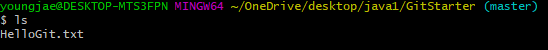

# Git-Start

## 항목

- 항목1
- 항목2
  - 세부항목1
  - 세부항목2
    - 세세부항목1

### 체크박스

- [ ] 체크박스1
- [x] 체크박스2

> 인용문구 작성 가능

#### 텍스트

데이터를 강조하고 싶을 땐 **강조** 사용합니다.

데이터 강조하고 싶을 땐 **_강조_** 를 사용합니다.

취소선은 ~~취소~~ 입니다.

##### 코드삽입

```java

public int add(int x, int y){
    return x + y;
}
// 주석입니다.
```

```sql

SELECT *
FROM users
WHERE users.id = 1;
```

##### 이미지, 링크 삽입



[네이버링크](https://www.naver.com)
